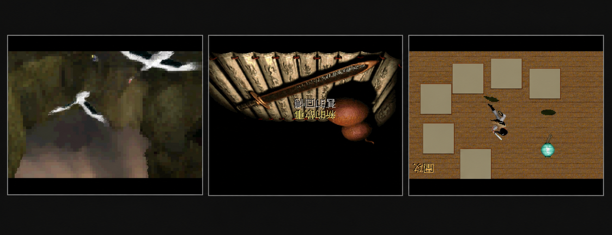

# SDLPAL for BBK 9588

把开源 SDLPAL 原生移植到步步高 9588（JZ4740/MIPS32）学习机。SDK 和
SDLPAL 都以固定提交的 submodule 引入；发布产物是固件直接执行的 BDA，模拟器只用于
开发和回归测试。



上图来自同一份 BDA 在 bbk9588-emulator v0.1.5 中实际运行的 AVI、标题和战斗帧，
仅裁掉模拟器外框后拼接。

## 快速开始

以下流程适用于有该私有仓库和私有 `release` 分支访问权的开发者。需要 Git、Git
LFS、PowerShell、Python 3.10+、FFmpeg，以及默认位于
`E:\bbk9588-emulator-v0.1.5` 的模拟器。

```powershell
git lfs install
git clone --recurse-submodules git@github.com:HelloClyde/pal1-for9588.git
cd pal1-for9588

# 从私有 release 分支取一个原版资源包，离线转码并生成设备包
.\tools\prepare-9588-resources.ps1

# 构建原生 MIPS BDA，并把 BDA + 单资源包放入隔离 NAND 启动
.\tools\build.ps1
.\tools\test-with-resources.ps1 .\build\PAL9588.PAK -ResetImage
```

输出文件：

- `build\Pal1-9588.bda`：9588 原生程序；
- `build\PAL9588.PAK`：设备端唯一需要的只读游戏资源包。

真机安装时，将 BDA 放到 `A:\应用\程序\`，将 `PAL9588.PAK` 放到
`A:\应用\数据\PAL\`。存档、配置和诊断日志仍以普通可写文件保存在后一个目录。

## 当前状态

- 完整 SDLPAL 游戏、地图、脚本、UI、战斗和存档核心参与构建。
- 320×200、8 位调色板画面以原始比例居中显示，并旋转到 240×320 屏幕。
- 已接入 22050 Hz、16-bit、单声道 PCM：RIX/OPL 音乐和 DOS VOC/Win95 WAV
  音效由 SDLPAL 解码、混音后送入 SDK 队列。
- 已接入 SDLPAL 开源 Microsoft Video 1 解码器；六段 PAL98 AVI 在电脑端保留原始
  288×180 分辨率离线转码，设备端直接播放视频和 PCM 音轨。
- BDA 可从单个 `PAL9588.PAK` 随机读取全部 MKF、文本、字体和 AVI，不会先把包展开
  到 NAND。
- 模拟器已验证单包启动、AVI 与音频播放、存档重启读回、自动战斗胜利和六段视频
  回归。真机性能、按键手感、扬声器表现及完整剧情仍需实体 9588 复测。

## 资源工作流

### 私有原版包

`main` 和正常开发分支不包含商业资源。用户合法购买的原版数据只保存在同一私有
GitHub 仓库的 `release` 分支中：

```text
release-assets/PAL-ORIGINAL.PAK
```

该文件由 Git LFS 管理，是 DOS 版游戏数据和 PAL98 六段原始 AVI 合成的一个包。
`release` 分支不得合并进 `main`，仓库改为公开前必须先删除该分支和对应 LFS 对象；
资源版权不因存入私有仓库而改变。

若没有 `release` 分支访问权，可以直接从自己安装的 Steam 经典版创建本地原版包：

```powershell
.\tools\pack-original-resources.ps1 `
    -DosPath 'D:\Program Files (x86)\Steam\steamapps\common\PAL\PAL_DOS' `
    -Pal98Path 'D:\Program Files (x86)\Steam\steamapps\common\PAL\PAL98'

.\tools\prepare-9588-resources.ps1 `
    -OriginalPack .\build\PAL-ORIGINAL.PAK
```

所有 staging 目录和资源输出都位于被 Git 忽略的 `build\` 下。

### 设备单包

`prepare-9588-resources.ps1` 会执行以下操作：

1. 从私有 `release` 分支通过 Git LFS 取得 `PAL-ORIGINAL.PAK`，或使用
   `-OriginalPack` 指定本地包；
2. 校验原版资源，使用 FFmpeg 将 1–6 号 AVI 转为 288×180、12 fps、MS Video 1、
   11025 Hz、8-bit mono PCM；
3. 把核心资源与转码视频打成一个 `build\PAL9588.PAK` 并逐项校验 CRC32。

当前测试包包含 27 个条目（含新游戏初始模板 `0.RPG`），大小约 49.2 MiB。PAK
采用未压缩、16-byte 对齐的目录格式，换取低内存和真正的随机读取；BDA 的
`access`/`fopen`/`fread`/`fseek`/`ftell`
会把包内条目作为普通只读文件暴露给未修改的 SDLPAL。包内文件优先于同名散文件，
写入始终落到普通 NAND 文件。格式见 [docs/palpak-format.md](docs/palpak-format.md)。

可单独使用打包工具：

```powershell
python -S .\tools\palpak.py list .\build\PAL9588.PAK
python -S .\tools\palpak.py verify .\build\PAL9588.PAK
python -S .\tools\palpak.py extract .\build\PAL9588.PAK .\build\unpacked
```

## 构建

首次构建会使用 SDK 脚本安装并校验 MIPS 工具链：

```powershell
.\tools\build.ps1
```

已有工具链时可设置：

```powershell
$env:BDA_TOOLCHAIN_PREFIX = 'C:\toolchains\mips\bin\mipsel-none-elf-'
.\tools\build.ps1 -SkipToolchainSetup
```

输出同时包含 BDA、ELF、map 和反汇编文件。两个 submodule 必须停在仓库记录的提交；
不要直接改用 SDLPAL 最新主线。

## 模拟器测试

只有 BDA、没有游戏资源的启动冒烟测试：

```powershell
.\tools\test-emulator.ps1 -ResetImage
```

使用推荐的单包测试：

```powershell
.\tools\test-with-resources.ps1 .\build\PAL9588.PAK -ResetImage
```

脚本仍兼容传统散文件目录，便于诊断和资源比对：

```powershell
.\tools\test-with-resources.ps1 D:\Games\PAL -ResetImage
```

更详细的结构和实测记录见 [docs/porting.md](docs/porting.md) 与
[docs/testing.md](docs/testing.md)。

## 许可证与来源

移植代码采用 GPL-3.0-or-later。SDLPAL 完整许可见
`third_party/sdlpal/gpl.txt`，SDK 许可见 `sdk/LICENSE`。商业游戏资源不属于本项目
许可证，只能由拥有合法副本且获准访问私有仓库的人使用。

参与开发前请阅读 [CONTRIBUTING.md](CONTRIBUTING.md)。
